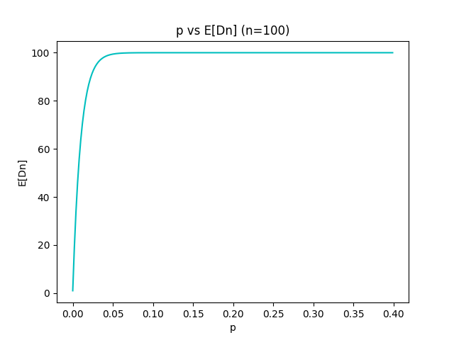
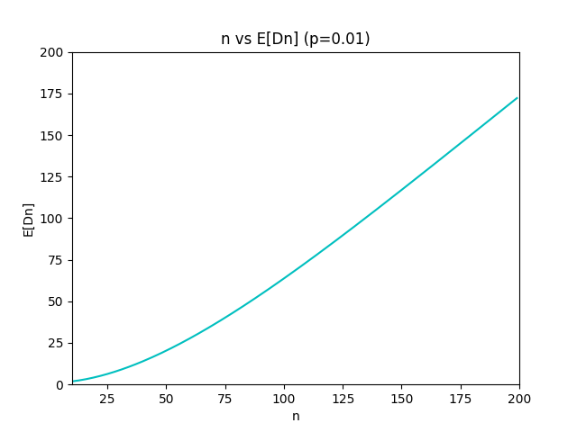
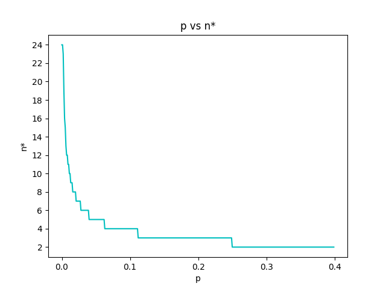
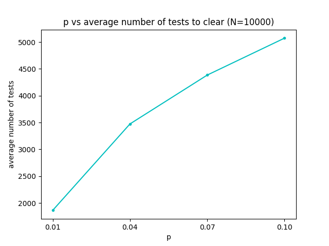
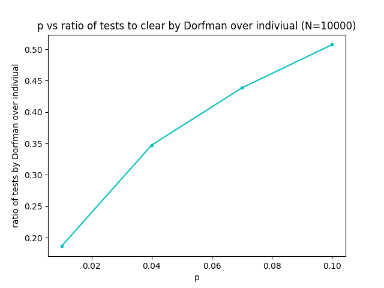
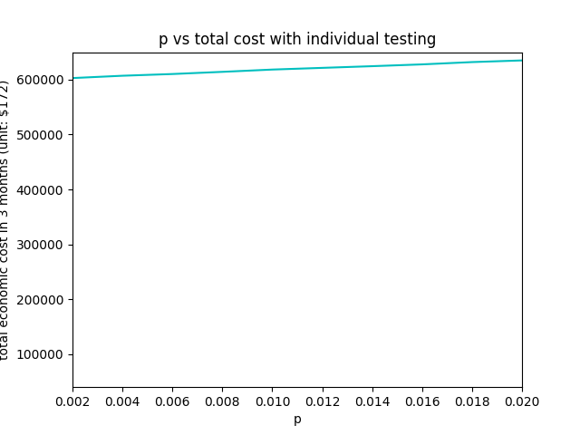
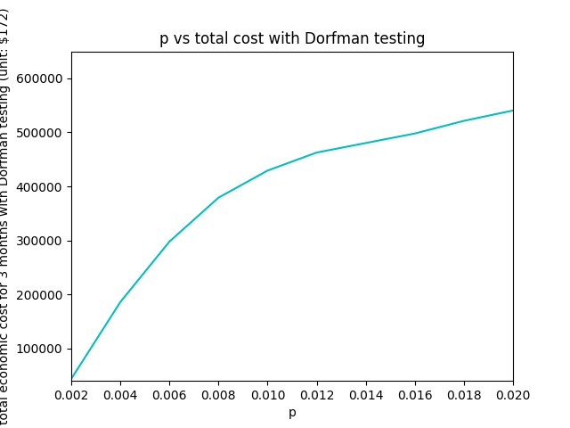

## ECE 3100 Final Report
# Group Testing for COVID-19 Screening


## Part I: Dorfman Testing Strategy
Note: see appendix for code

## 1a)
p - infection rate  
n - group size  
Dn - number of tests to identify all infected person in group of n  
Denote event A be everyone in the group are not infected.
Denote event D be the number of tests needed to identify all infected person.  
E[Dn] = P(D|A) * P(A) + P(D| A<sup>c</sup>) * P(A<sup>c</sup>), by total expected theorem  
= 1 * (1-p)<sup>n</sup> + n * (1-(1-p)<sup>n</sup>)  
= n + (1-n) * (1-p)<sup>n</sup>  

E[Dn] and p relationship:
Q1-a figure 1  
  
As p increases, E[Dn] increases greatly. This is because as p increases, the chance of being negative decrease and the chance of having everyone in one group to be not infected decreases. Thus taking longer to test out all the infected people.

E[Dn] and n relationship:
Q1-a figure 2  
  
As n increases, E[Dn] also increases. This is because as n increases, the chance of having everyone in one group to be not infected decreases. Thus taking longer to test out all the infected people.

## 1b)
How infection rate p affects the optimal group size n∗: Q1-b figure 1  
  
As p increases, n* decreases. This is because as p increases, the probability of a group of n people being all not infected decrease. So the benefits of Dorfman testing decrease, and max of the expected number of persons cleared per test under the Dorfman testing strategy with a group size n, n*, decrease.

## 1c)
Plot: The average number (averaged over 1000 independent runs of the experiment) of tests needed to clear the entire population as a function of p: Q1-c figure 1  
  
As p increases, the average number of tests needed to clear all people with Dorfman testing increases, so the reduction of test becomes less.

Plot: The ratio of the number of tests needed under the Dorfman testing strategy over that required by the individual testing strategy as a function of p: Q1-c figure 2  
  
In addition to the fact that an increase in p weakens the reduction of test for Dorfman. Since the individual testing strategy always needed n tests to clear out n people, for population N = 10000, it always need 10000 test, p has no effect on the efficiency of individual testing. Therefore the ratio between Dorfman and individual testing is just Dorfman/10000, and the pattern or shape of the graph does not change.  
In conclusion, the as the infection rate p increase, reduction in tests of the Dorfman strategy over the individual testing strategy decrease.

## 1d)

Goal - Minimize social/economic cost  
Assumptions:  
- Start on day 1, continue for 3 months, assume 30 days in each month, so day ranges in [1,90].   
- On day 1, everyone have probability p of being infected.  
- Every person needs a test after 7 days.  
- Every person not being to work (due to test limitation or was sick) results in a lose of $172 dollars per day.  
- We are not going to care about which person gets the test and which do not, given they are both eligible for a test, because there is no difference in the economic cost between them. (This means that a person who didn't get a test for 30 days have the same testing priority as a person who didn't get a test for 1 day.)  

__Individual Testing:__

1. Testing strategy  
All tests should be used in a day.  
Give tests to individual when they need a new test to go to work. Need is satisfied by healthy (or seemingly healthy) people, who was tested healthy last time 7 or more days ago, and recovered sick people who was infected 21 or more days ago.  

2. Reasoning  
Since the population is 10000 and everyone need a new test every 7 days, so we need to do at least 70000 tests a week to keep everyone a valid test. However, our daily available test is just 500, so 7 * 500 = 3500 tests weekly. This is very far from the 70000 tests that's needed. Therefore, our main goal is just to use as many tests as possible in order to minimize the cost, which means we give test to people that would not be able to work without a negative test and would be able to work with a negative test.  

- Basic steps of code:  
Initialize the first day sick/healthy situation.
For each day, calculate the economic cost for people who cannot work. then update the people list to simulate people getting sick, then do tests for 500 people who need test. Continue this process until day 90.


__Dorfman Testing:__

- Testing strategy  
Almost all tests should be used in a day.  
Give tests to a group of n_star people who need a new test to go to work. Need is satisfied by healthy (or seemingly healthy) people, who was tested healthy last time 7 or more days ago, and recovered sick people who was infected 21 or more days ago. Then if there are extra tests after providing everyone that immediately need a test, start giving tests to people with the nearest needing test date.

- Reasoning  
Since Dorfman testing is very efficient in finding infected people or clearing healthy people when p is small, we expect that some day Dorfman will provide enough test for everyone. In this case, we start giving people more tests in advance so people don't have to wait till the last day to get a test. In our simulation we chose to give tests to people 1 or 2 days in advance and 3 or 4 days in advance. This is a choice that is reasonable because we testing too much in advance is not necessary and around half a week in advance is a reasonable cutoff.

- Basic steps of code  
Initialize day 0 sick/healthy situation in population.  
For given p, find the n_star group in the population with the Dorfman method.  
For each day, start testing people in need of tests in a group of n_star people. If the remaining available test in a day is less then n_star + 1, switch to individual test for such remaining evadible tests.  
Prioritize and give test to people that need test tomorrow first.  
If more tests are left, give test to people that need test in two days.  
If still have more test left, give test to people that need test in four days.  
Repeat until day 90.
Note: For graphing with more actuate values, I run 10 trials and averaged the result to get the final answer.

Results of Individual and Dorfman testing strategy simulation is the following graphs.  
Note: y axis are in $172 unit. For example, 100000 means a economics cost of  $17200000.

Q1-d figure 1  
 

Q1-d figure 2  
  
Based on the x and y axis on the same scale, we can easy see that the total economic cost for individual testing is a lot more than Dorfman testing.  
For individual testing, the cost are steadily around 600000 * $172 and slowly increasing as p increase, but both around 610000 * $172 for p = 0.002 and p = 0.02. For Dorfman testing, the cost ranges quite large, from a cost around 40000 * $172 with small p of 0.002, and around 550000 * $172 with a bigger p of 0.02.  
Individual test's economic cost is robust to change in p but with high average cost compare to Dorfman testing. Dorfman have extremely low cost when p is small but losses the huge advantage after p increase compare to individual testing. However, in this range of p [0.002,0.02], Dorfman still always have a smaller economic cost than individual testing.


## Part II: The Binary Splitting Strategy

### Each person in this population is infected with probability p, independent of others. If none of the n people in the group is infected, the group test outcome is negative. If there is at least one infected person in the group, the test outcome is positive.

## 2a)
**E[B2]** denotes the number of tests required to identify all (if any) infected persons with an initial group size 2 under the binary splitting strategy

We will use the total expectation theorem.

Let event P be the event that the test of the entire group of 2 people is positive. That is going to happen when at least one person in the entire group tests positive as explained. 
Similarly, event P<sup>c</sup>  is the event that the test of the entire group of 2 people is negative. That is going to happen when all people in the group of 2 test negative. 

E[B2] = pr(P)E[B2|P] + pr(P<sup>c</sup>)E[B2|P<sup>c</sup>]

The formula is written that way by the total expectation theorem since we can partition the sample space into 2 possible events: the first event is the event that the group tests positive, i.e. event P, and the second event is the complement of the first event which is that everyone in the group tests negative, i.e. event P<sup>c</sup>. That forms a partition since both events are disjoint, i.e. P and P<sup>c</sup> are disjoint since they both can’t happen together: either all people are not infected or at least someone is infected. Also, P U P<sup>c</sup> = Ω as either one event happens or the other as I mentioned above. Thus, the formula is satisfied by the total expectation theorem.
To find pr(P<sup>c</sup>), 
pr(P<sup>c</sup>) =  (1- p)<sup>2</sup>   since we would need each person in the group to test negative. Let event I be the event that one person tests negative. Since each one is infected with probability p, independent of others, the probability of everyone testing negative would just be (pr(I))<sup>2</sup> as there are 2 people in the group. pr(I)=  1- p since p is the probability one person tests positive and hence 1-p is the probability at least one person tests negative 

To find pr(P)
pr(P) = (1- (1-p<sup>2</sup>))
The reason is for event P to be satisfied, we would need at least one person in the group to test positive as that would lead to the entire group testing positive as in the description of the problem. We can think of event P as the complement of event P<sup>c</sup> as P would happen when at least one person tests positive. That is because P<sup>c</sup> represents the event that no person in the group is positive and thus its complement would be that at least one person tests positive. Thus pr(P)= 1- pr(sup>c</sup>) =  (1- (1-p<sup>2</sup>))


Introduce random variable C2 such that
C2 : the number of tests required to identify all infected individuals in a group of size 2 given that at least one of these 2 persons is infected.

To find E[B2|P],
E[B2|P] = 1+ E[C2] . The reason is that given P, we would know that at least one person tests positive in the group of 2 people and hence the number of tests required to identify the infected people in the group of 2 people given that at least someone is infected is E[C2] by definition. We would still need to do the initial test of the entire group to find that someone tested positive. Thus, E[B2|P] is 1 , which is the initial test done, added to E[C2].

To find E[B2|P<sup>c</sup>],
E[B2|P<sup>c</sup>] = 1 since we need to do one test to find out that no person is infected in the group which is the initial test done. Then, we stop since we find out that no person is infected in the group and thus no further testing is needed.

Thus, 
E[B2] = pr(P)E[B2|P] + pr(P<sup>c</sup>)E[B2|P<sup>c</sup>]

E[B2]= pr(P)(1+E[C2]) +1*(1-p)<sup>2</sup>
E[B2]= (1- (1-p<sup>2</sup>))(1+E[C2]) +1* (1-p)<sup>2</sup>

Define event F to be the event that at least one person in the left subgroup group of one person tests positive.
pr(F|P) represents the probability that at least one person in the left subgroup of one person tests positive given that at least one person in the group of 2 people test positive.
pr(F|P)= p / (1- (1-p)<sup>2</sup>) by using the conditional probability law:
<br>
Steps : pr(F|P) = pr (F ⋂ P) / pr (P) = p / (1- (1-p)<sup>2</sup>).
Pr (F ⋂ P) = p since pr(F)=p and if one person in the left subgroup of one person tests positive then P holds true. 

pr(F<sup>c</sup>|P)= probability that the left subgroup of 1 person tests negative given that at least one person in the group of 2 people tests positive = (1- pr(F|P)) . That is because pr(F<sup>c</sup>|P) is the complement of pr(F|P).

E[C2|F<sup>c</sup>⋂ P] = 1 since would need to do a test to find the left subgroup tests negative and once we do, we already know that the right subgroup of 1 person tests positive since we are given P. Thus, in that case we would just be doing 1 test for this event.

E[C2|F ⋂ P] = 1+1=2. The reason is that we would do the first test on the left subgroup of 1 person. Then, in this case since we are given F and P, we don’t know if the right subgroup of 1 person tests positive or negative as we don’t have enough information to find that out. F tells us the left subgroup tests positive and P tells us the group of 4 people test positive so we don’t have additional information about the right subgroup. Thus, we would need to do one test on the right subgroup in addition since it just has one person and hence the total for this event is 2.

Thus,
E[C2|P] = pr(F|P)E[C2|F ⋂ P] + pr(F<sup>c</sup>|P)E[C2|F<sup>c</sup> ⋂ P]
E[C2|P] = 2pr(F|P) + 1(1- pr(F|P)) = (2p / (1- (1-p)<sup>2</sup>) + 1- (p / (1- (1-p)<sup>2</sup>)
= 1 + (p / (1- (1-p)<sup>2</sup>)= (3p-p<sup>2</sup>)/(1-(1-p)<sup>2</sup>)

E[B2] = (1+E[C2])( 1- (1-p)<sup>2</sup>)+  (1-p)<sup>2</sup> =(1- (1-p)<sup>2</sup>)+ (1 + (p / (1- (1-p)<sup>2</sup>))( 1- (1-p)<sup>2</sup>) + (1-p)<sup>2</sup> =2( 1- (1-p)<sup>2</sup>) + p +  (1-p)<sup>2</sup>= 1+ 3p-p<sup>2</sup>

**E[B2] = 1+ 3p-p<sup>2</sup>**

## 2b)

Introduce the random variables C2 and B2 such that 
C2 : the number of tests required to identify all infected individuals in a group of size 2 given that at least one of these n persons is infected.
B2: the number of tests required when there is no additional information about this group of 2 persons except the prior knowledge that each one is infected with probability p independently. 

We will use the total expectation theorem.

Let event P be that the test of the entire group of 4 people is positive. That is going to happen when at least one person in the entire group tests positive as explained. 

Event P<sup>c</sup> would then represent the event that the test of the entire group is negative and hence all 4 people tested negative.

E[B4] = pr(P)E[B4|P] + pr(P<sup>c</sup>)E[B4|P<sup>c</sup>]

The formula is written that way by the total expectation theorem since we can partition the sample space into 2 possible events: the first event is the event that the group tests positive and that happens when at least one person in the group tests positive, i.e. event P, and the second event is the complement of the first event which is that everyone in the group tests negative, i.e. event P<sup>c</sup>. That forms a partition since both events are disjoint, i.e. P and P<sup>c</sup> are disjoint since they both can’t happen together: either all people are not infected or at least someone is. Also, P U P<sup>c</sup> = Ω as either one event happens or the other as i mentioned above. 
To find pr(P<sup>c</sup>), 
p(P<sup>c</sup>) =  (1- p)<sup>4</sup> since we would need each person in the group to test negative. Let event I be the event that one person tests negative. Since each one is infected with probability p, independent of others, the probability of everyone testing negative would just be pr(I)<sup>4</sup> as there are 4 people in the group. pr(I)= 1-p since p is the probability one person tests positive and hence (1- p)<sup>4</sup> is the probability one person tests negative.

To find pr(P)
pr(P) = 1- (1-p<sup>4</sup>)
The reason is for event P to be satisfied, we would need at least one person in the group to test positive as that would lead to the group testing positive as in the description of the problem. We can think of event P as the complement of event P<sup>c</sup> as P would happen when at least one person tests positive. That is because  P<sup>c</sup> represents the event that no person in the group is positive and thus its complement would be that at least one person tests positive. Thus pr(P)= 1- pr(P<sup>c</sup>) = 1- (1-p<sup>4</sup>)

Thus,
E[B4] = pr(P)E[B4|P] + pr(P<sup>c</sup>)E[B4|P<sup>c</sup>]
E[B4] = (1- (1-p<sup>4</sup>))E[B4|P] + (1- p)<sup>4</sup> E[B4|P<sup>c</sup>]

To find E[B4|P], 
E[B4|P] = 1+ E[C4|P] . The reason is that given P, we would know that at least one person tests positive in the group of 4 people and hence the number of tests required to identify the infected people in the group given that at least someone is infected is E[C4|P] by definition. We would still need to do the initial test of the entire group to find that someone tested positive so we add 1 to E[C4|P].
E[B4|P<sup>c</sup>] = 1 since we need to do one test to find out that no person is infected in the group and then there would be no further testing needed.

Thus,
E[B4]= (1-(1-p)<sup>4</sup>)(1+ E[C4|P])+ (1-p)<sup>4</sup>

To find E[C4], we will do the following work:
Define event F to be the event that at least one person in the left subgroup of 2 people tests positive.
pr(F|P) represents the probability that at least one person in the left subgroup of 2 people tests positive given that at least one person in the group of 4 people test positive.
pr(F|P)=  (1-(1-p)<sup>2</sup>)/(1-(1-p)<sup>4</sup>) by using the conditional probability law:
Steps : pr(F|P) = pr (F ⋂ P) / pr (P) =  (1-(1-p)<sup>2</sup>)/(1-(1-p)<sup>4</sup>).
Pr (F ⋂ P) = (1-(1-p)<sup>2</sup>). since pr(F)= (1-(1-p)<sup>2</sup>) and if one person in the first group of 2 people tests positive then P holds true. Let us explain why pr(F) is the way it is:
Fc represents the event that no person in the first group of 2 people tests positive. 
pr(F<sup>c</sup>)= (1-p)<sup>2</sup> since the probability that only one person tests negative = 1- p and hence because people tests are independent, we get that answer.

Thus,
E[C4|P] = pr(F|P) E[C4|P⋂ F] +  pr(Fc|P)E[C4|P⋂ F<sup>c</sup>)] 

E[C4|P⋂ F<sup>c</sup>)] = (1 + E[C2]). The reason is we would need to do the initial test of the left subgroup of 2 people to find that the left subgroup tests negative. Then, knowing this and knowing that event P happened we know now that the right subgroup of 2 people must definitely test positive since we know event P happened and that is that the whole group tests positive. The expected number of tests for this scenario would be (1 + E[C2]) as a result.

Thus,
E[C4|P] =pr(F|P) E[C4|P⋂ F] + (1 + E[C2])(1- pr(F|P))

To find E[C4|P⋂ F],
E[C4|P⋂ F]= (1 + E[B2]+ E[C2]). The reason is we first do an initial test of the left subgroup of 2 people. Then, now that we know that the left subgroup of 2 people tested positive, the expected number of tests needed for the left subgroup would be E[C2] by definition of C2 as we know now that at least one person in the left subgroup tested positive from the initial test we did. Now, the right subgroup might or might not test positive. The information we have which is event P and F are not enough to tell us information on the right subgroup. The reason is from event P, we know that at least one person in the group of 4 people tested positive and given F we would know that at least one person in the left subgroup of 2 people tested positive. Thus, the expected number of tests for the right subgroup is just E[B2] by definition of B2. That is how we get the answer

Thus,
E[C4|P] =pr(F|P)(1 + E[B2]+ E[C2]) + (1 + E[C2])(1- pr(F|P))
= 1+ pr(F|P)E[B2] + E[C2]


E[B4] = (1-(1-p)<sup>4</sup>)(2+ pr(F|P)E[B2]+E[C2]) + (1-p)<sup>4</sup>
=(1-(1-p)<sup>4</sup>)(2+ ((1-(1-p)<sup>2</sup>)/(1-(1-p)<sup>4</sup>))E[B2] + E[C2]) + (1-p)<sup>4</sup>

This simplifies to:
**E[B4]= 2 - (1-p)<sup>4</sup>(1+E[C2])+ (1- (1-p)<sup>2</sup>)E[B2] + E[C2]**


**No, I don’t think it is necessary to test the second subgroup of 2 people together before further splitting. The reason is we already know that at least one person tested positive in the group of 4 people and that is why we did not stop testing. If we knew that no person in the group of 4 people tested positive, then we would have just done one test and stopped. Now, after we did a test on the first subgroup of 2 people, our information became updated to show that at least one person in the group of 4 people tested positive and no one in the first subgroup of 2 people tested positive. That means that we are certain now that at least one person in the second subgroup of 2 people tested positive. Therefore, we don’t need to test the second subgroup before further splitting since we already know at least one person in the second group tested positive.**

## 2c)

Introduce the random variables Cn and Bn such that 
Cn : the number of tests required to identify all infected individuals in a group of size n given that at least one of these n persons is infected.
Bn: the number of tests required when there is no additional information about this group of n persons except the prior knowledge that each one is infected with probability p independently. 

We will use the total expectation theorem.

Let event P be that the test of the entire group of n people is positive. That is going to happen when at least one person in the entire group tests positive as explained. 

Event P<sup>c</sup>) would then represent the event that the test of the entire group is negative and hence all n people tested negative.

E[Bn] = pr(P)E[Bn|P] + pr(P<sup>c</sup>))E[Bn|P<sup>c</sup>)]

The formula is written that way by the total expectation theorem since we can partition the sample space into 2 possible events: the first event is the event that the group tests positive and that happens when at least one person in the group tests positive, i.e. event P, and the second event is the complement of the first event which is that everyone in the group tests negative, i.e. event P<sup>c</sup>). That forms a partition since both events are disjoint, i.e. P and P<sup>c</sup>) are disjoint since they both can’t happen together: either all people are not infected or at least someone is. Also, P U P<sup>c</sup> = Ω as either one event happens or the other as i mentioned above. 
To find pr(P<sup>c</sup>)), 
p(P<sup>c</sup>)) =  (1- p)<sup>n</sup>   since we would need each person in the group to test negative. Let event I be the event that one person tests negative. Since each one is infected with probability p, independent of others, the probability of everyone testing negative would just be pr(I)<sup>n</sup> as there are n people in the group. pr(I)= 1-p since p is the probability one person tests positive and hence (1- p)<sup>n</sup> is the probability one person tests negative.

To find pr(P)
pr(P) = 1- (1-p<sup>n</sup>)
The reason is for event P to be satisfied, we would need at least one person in the group to test positive as that would lead to the group testing positive as in the description of the problem. We can think of event P as the complement of event P<sup>c</sup>) as P would happen when at least one person tests positive. That is because P<sup>c</sup>) represents the event that no person in the group is positive and thus its complement would be that at least one person tests positive. Thus pr(P)= 1- pr(P<sup>c</sup>)) = 1- (1-p<sup>n</sup>)

Thus,
E[Bn] = pr(P)E[Bn|P] + pr(P<sup>c</sup>))E[Bn|P<sup>c</sup>)]
E[Bn] = (1- (1-p)<sup>n</sup>))E[Bn|P] + (1-p)<sup>n</sup> E[Bn|P<sup>c</sup>)]

To find E[Bn|P], 
E[Bn|P] = 1+ E[Cn|P] . The reason is that given P, we would know that at least one person tests positive in the group of n people and hence the number of tests required to identify the infected people in the group given that at least someone is infected is E[Cn|P] by definition. We would still need to do the initial test of the entire group to find that someone tested positive so we add 1 to E[Cn|P].
E[Bn|Pc] = 1 since we need to do one test to find out that no person is infected in the group and then there would be no further testing needed.

Thus,
E[Bn]= (1-(1-p)<sup>n</sup>)(1+ E[Cn|P])+ (1-p)<sup>n</sup> 

In fact, E[Cn|P] = E[Cn] by definition since Cn is the number of tests required to identify all infected individuals in a group of size n given that at least one of these n persons is infected.

so 
E[Bn]= (1-(1-p)<sup>n</sup>)(1+ E[Cn])+ (1-p)<sup>n</sup>
The above equation is E[Bn] in terms of Cn as needed. Now , we need to find the equation for E[Cn]

To find E[Cn], we will do the following work:
Define event F to be the event that at least one person in the left subgroup of n/2 people tests positive.
pr(F|P) represents the probability that at least one person in the left subgroup of n/2 people tests positive given that at least one person in the group of n people test positive.
pr(F|P)=  (1-(1-p)<sup>n/2</sup>)/(1-(1-p)<sup>n</sup>) by using the conditional probability law:
Steps : pr(F|P) = pr (F ⋂ P) / pr (P) =  (1-(1-p)<sup>n/2</sup>)/(1-(1-p)<sup>n</sup>).
Pr (F ⋂ P) = (1-(1-p)<sup>n/2</sup>). since pr(F)= (1-(1-p)<sup>n/2</sup>) and if one person in the first group of n/2 people tests positive then P holds true. Let us explain why pr(F) is the way it is:
Fc represents the event that no person in the first group of n/2 people tests positive. 
pr(Fc)= (1-p)<sup>n/2</sup> since the probability that only one person tests negative = 1- p and hence because people tests are independent, we get that answer.

Thus,
E[Cn|P] =E[Cn] = pr(F|P) E[Cn|P⋂F] +  pr(Fc|P)E[Cn|P⋂ F<sup>c</sup>] 

E[Cn|P⋂F<sup>c</sup>] = (1 + E[Cn]). The reason is we would need to do the initial test of the left subgroup of n/2 people to find that the left subgroup tests negative. Then, knowing this and knowing that event P happened we know now that the right subgroup of n/2 people must definitely test positive since we know event P happened and that is that the whole group tests positive. The expected number of tests for this scenario would be (1 + E[Cn/2]) as a result.

Thus,
E[Cn|P] =pr(F|P) E[Cn|P⋂ F] + (1 + E[Cn])(1- pr(F|P))

To find E[Cn|P⋂ F],
E[Cn|P⋂ F]= (1 + E[Bn/2]+ E[Cn/2]). The reason is we first do an initial test of the left subgroup of n/2 people. Then, now that we know that the left subgroup of n/2 people tested positive, the expected number of tests needed for the left subgroup would be E[Cn/2] by definition of Cn/2 as we know now that at least one person in the left subgroup tested positive from the initial test we did. Now, the right subgroup might or might not test positive. The information we have which is event P and F are not enough to tell us information on the right subgroup. The reason is from event P, we know that at least one person in the group of n people tested positive and given F we would know that at least one person in the left subgroup of n/2 people tested positive.  Why is the expected number of tests done for the left subgroup of n/2 people is actually E[Bn/2]. We explained this above but to reiterate, the idea is that given P, we know that at least one person in the group of n people is infected and given F we know at least one person in the left subgroup of n/2 people is infected. Thus, we don’t have information about the right subgroup of n/2 people. That is by definition what  the random variable Bn/2 describes so we have to use E[Bn/2] to find the expected number of tests for the right subgroup of n/2 people. That is how we get the answer

Thus,
E[Cn|P] = E[Cn] = pr(F|P) (1 + E[Bn/2]+ E[Cn/2]) + (1 + E[Cn/2])(1- pr(F|P))
= 1+ pr(F|P)E[Bn/2] + E[Cn/2]

The final equation of E[Bn] in terms of E[Cn] is below. The final equation of E[Cn] in terms of E[Cn/2] and E[Bn/2] is below.
<br>
__E[Bn]= (1-(1-p)<sup>n</sup>)(1+ E[Cn])+ (1-p)<sup>n</sup>__
<br>
__E[Cn] = 1+ pr(F|P)E[Bn/2] + E[Cn/2]__

__where pr(F|P)=  (1-(1-p)<sup>n/2</sup>)/(1-(1-p)<sup>n</sup>)__

## 2d)

I used code to find that.  
What I did in the code is that I first set p to 0.01 for example.
Then, I created an array of a big size or the efficiency of the program. I created an array for the expected value of Bn called Expected_Bn[] and an array for the expected values of Cn called Expected_Cn[] . Then, I wrote the equation for expected values of Bn at n=2 that we got from the previous parts of problem 2 and set that value to index 2 of the array Expected_Bn so I set the value to Expected_Bn[2]. Then, I also wrote an equation for the expected value of Cn at n=2 that we got from the previous parts of problem 2 and set the value to index 2 of the array Expected_Cn[] so I set the value to Expected_Cn[2]. Now, we have an array that will store the expected value of Bn at many values of n as needed and we have an array that will store the expected value of Cn at many values of n as needed. We also create an array called n_div_Expected_Bn[] that is equal to n/Expected_Bn[n]. That means the array n_div_Expected_Bn[]  will describe the efficiency as stated in the problem for some value of n. We now have our arrays ready and we can start the process of filling them. I set a variable n to 4 since we have the needed information for n=2. Then, I started a while loop where I wrote the equation for Expected_Bn[] at some index n using the equation we have from part 2c. I also wrote the equation for Expected_Cn[] at some index n using the information we have from part 2c. Then, I said let n_div_Expected_Bn(n) = n/ Expected_Bn(n) to calculate the efficiency for some n. I let the while loop stop when n>=10000000000 so as to run the program on a large number of n. Then, after the while loop ended, I used the max() function to find the value of n at which n_div_Expected_Bn[] is maximized meaning efficiency is maximized. I returned that value as that would be the final value we need, the optimal group size n* that maximizes the efficiency of the binary splitting strategy. I did that for all values of p, each of p=0.01, 0.04, 0.07 and 0.1. Everytime, I need to find the value of the optimal n* for some p, I just changed the value of p at the top of the code .

__p= 0.01, n* = 64__
<br> 
__p = 0.04, n* = 16__
<br> 
__p = 0.07, n* =8__
<br> 
__p = 0.1, n* =8__
<br> 

## 2e)

For p = 0.01, 0.04, 0.07, 0.1, numerically solve the expected number of tests needed to screen a population of N = 10, 000 under the binary splitting strategy:

For N=10,000

The technique we will do since 10,000 is not a power of 2 as the equation for 2c is used is: We will divide the population of 10,000 into maximum possible groups of optimal size and test the remainder using Binary testing. The optimal sizes are chosen such that the remainder is also a power of two.<br>

__For p =0.01__ , the optimal group size at that value of p is 64 as found in part 2d.
Divide 10,000 into 156 groups of 64 people and one group of 16 people as  remainder so
10,000 = 156(64) + 16

Find the expected number of tests for a group of 64 and a group of 16. Then, use linearity of expectation to get:
E[B10000]= 156E[B64] +  E[B16]
Thus, expected number of tests = 156E[B64] + E[B16]
E[B64] = 6.3387 found from the code 
E[B16] = 1.9355  found from the code
E[B10000] = 156(6.3387) + 1.9355 = __990.7689__

__For p=0.01, the expected number of tests needed to screen a population of N = 10, 000 under the binary splitting strategy is 990.7689__


__For p=0.04__, the optimal group size at that value of p is 16 as found in part 2d.
Divide 10,000 into 625 groups of 16 people exactly
10,000 = 625(16)

Find the expected number of tests for a group of 16 people. Then, use linearity of expectation to get:
E[B10000]= 625E[B16] 
Thus, expected number of tests = 625 E[B16] 

E[B16] =  4.4801 as found by code 
E[B10000] = 625E[B16] = __2800.1__

__For p=0.04, the expected number of tests needed to screen a population of N = 10, 000 under the binary splitting strategy is 2800.1__

__For p=0.07__, the optimal group size at that value of p is 8 as found in part 2d.
Divide 10,000 into 1250 groups of 8 people exactly
10,000 = 1250(8)

Find the expected number of tests for a group of 8 people. Then, use linearity of expectation to get:
E[B10000]= 1250E[B8] 
Thus, expected number of tests = 1250E[B8] 

E[B8]= 3.2869 as found by code 
E[B10000] = 1250 * E[B8] = __4108.6__ 

__For p=0.07, the expected number of tests needed to screen a population of N = 10, 000 under the binary splitting strategy is 4108.6__


__For p=0.1__, the optimal group size at that value of p is 8 as found in part 2d.
Divide 10,000 into 1250 groups of 8 people exactly
10,000 = 1250(8)

Find the expected number of tests for a group of 8 people. Then, use linearity of expectation to get:
E[B10000]= 1250E[B8] 
Thus, expected number of tests = 1250E[B8] 

E[B8]=  4.1412  as found by code 
E[B10000] = 1250 * E[B8] = __5176.5__

__For p=0.1, the expected number of tests needed to screen a population of N = 10, 000 under the binary splitting strategy is 5176.5__

For p = 0.01, 0.04, 0.07, 0.1, numerically solve the expected number of tests needed to screen a population of N = 10, 000 under the Dorfman strategy: 
using code:
__For p=0.01, the expected number of tests needed to screen a population of N = 10, 000 under the Dorfman strategy is 1859.97__
__For p=0.04, the expected number of tests needed to screen a population of N = 10, 000 under the Dorfman strategy is 3476.884__
__For p=0.07, the expected number of tests needed to screen a population of N = 10, 000 under the Dorfman strategy is 4386.586__
__For p=0.1, the expected number of tests needed to screen a population of N = 10, 000 under the Dorfman strategy is 5080.945__

As shown, the binary splitting strategy for each value of p offers lower expected number of tests for all probability values expect at p=0.1. For instance, at p=0.01, the binary splitting strategy has expected number of tests of 990.7689 versus the Dorfman strategy needs 1859.97 tests. For p=0.04, the binary splitting startgey has expected number of tests of 2800.1 versus the Dorfman strategy needs 3476.884 tests for that same value of p. For p=0.07, the binary splitting stratgey has expected number of tests of 4108.6 versus the Dorfman strategy that has exepected number of tests of 4386.586. For p=0.1, the binary splitting strategy has expected number of tests of 5176.5 versus the Dorfman strategy which has a lower number of 5080.945. A shown, the improvement of the binary splitting strategy from Dorfman is affected by p. At p=0.01, the binary splitting strategy has expected number of tests about a half of the Dorfman strategy. As p increases from 0.01 to 0.04 to 0.07 to 0.1, the gap between the binary splitting strategy and the Dorfman strategy lessens so that the number of tests offered by the binary splitting strategy is more than that of the Dorfman startegy at p=0.1. when the group tests negative, both don't do further testing. However, when the group tests positive, that is when the 2 strategies differ. The Dorfman startegy  will test all individuals to identify the infected people. While the Binary splitting strategy will first split the 2 groups knowing the main group tested positive. It will first test the left sungroup and check if it tested postive or not, if it did not, then it tests the right subgroup in binary way too but if it did instead then it will test the first subgroup further using binary strategy along with the second subgroup. Thus, the binary is expected to have a better performance than the Dorfman in general since it does not test every person once it finds the group infected. At p=0.01, we see the binary offering lower number of tests than the Dorfman than compared to p=0.07, the reason is at a lower p, we will have a lower infection rate and thus when the Dorfman finds the group positive,  person infected, they will test every person in the group to check if he is infected or not. However, the binary will split the group to see if the left subgroup is positive and only then test it by binary and also check if the right subgroup is positive. Therefore, for lower infection rates such as at p=0.01, the binary will do in expected less tests than Dofrman since it will not test every person necessarily due to the lower infection rates and hence lower probabilities for groups of people to be infected.
# Appendix - code:  
## 1a)
```
import matplotlib.pyplot as plt
import numpy as np
import math

# 1.a - 1
n = 100
p = np.arange(0.0, 0.4, 0.001)
mean = []
for i in p:
    num = n + (1-n) * math.pow(1-i, n)
    mean.append(num)
plt.xlabel("p")
plt.ylabel("E[Dn]")
plt.title("p vs E[Dn] (n=100)")
plt.plot(p, np.array(mean), color='c')
plt.savefig('images/1.a-1.png')


# 1.a - 2
p = 0.01
n = np.arange(10, 200)
mean = []
for i in n:
    num = i + (1-i) * math.pow(1-p, i)
    mean.append(num)
plt.xlabel("n")
plt.ylabel("E[Dn]")
plt.title("n vs E[Dn] (p=0.01)")
plt.xlim([10, 200])
plt.ylim([0, 200])
plt.plot(n, np.array(mean), color='c')
plt.savefig('images/1.a-2.png')
```
## 1b)

```
import matplotlib.pyplot as plt
import numpy as np
import math

# 1.b - 1
p = np.arange(0.0, 0.4, 0.0005)
n = np.arange(0, 25)
n_star = []
for diff_p in p:
    max = 0
    max_n = 0
    for i in n:
        num = i / (i + (1-i) * math.pow(1-diff_p, i))
        if(num > max):
            max = num
            max_n = i
    n_star.append(max_n)
x_axis = [0.0, 0.1, 0.2, 0.3, 0.4, 0.5, 0.6, 0.7, 0.8, 0.9, 1.0]
plt.xticks(x_axis)
y_axis = range(0, 26, 2)
plt.yticks(y_axis)
plt.xlabel("p")
plt.ylabel("n*")
plt.title("p vs n*")
plt.plot(p, np.array(n_star), color='c')
plt.savefig('images/1.b-1.png')
```


## 1c)

```
import matplotlib.pyplot as plt
import numpy as np
import math
import random

# Q1 - c
# Manually checked correct by expectation theorem!

p = [0.01, 0.04, 0.07, 0.1]
n = np.arange(0, 25)
n_star = []
for diff_p in p:
    max = 0
    max_n = 0
    for i in n:
        num = i / (i + (1-i) * math.pow(1-diff_p, i))
        if(num > max):
            max = num
            max_n = i
    n_star.append(max_n)

total_test_lst = []
for index in range(4):
    p_cur = p[index]
    n_star_cur = n_star[index]
    total_test = 0
    for run in range(1000):
        population = 10000
        while(population != 0):
            n_cur = min(n_star_cur, population)
            population = population - n_cur
            infected = False
            for prob in range(n_cur):
                rand_num = random.random()
                if(rand_num < p_cur):
                    infected = True
                    break
            if(infected):
                total_test = total_test + n_cur
            else:
                total_test = total_test + 1
    average_test = total_test/1000
    total_test_lst.append(average_test)

print(total_test_lst)

plt.xticks(p)
plt.xlabel("p")
plt.ylabel("average number of tests")
plt.title(
    "p vs average number of tests to clear (N=10000)")
plt.plot(p, np.array(total_test_lst), '.-c')
plt.savefig('images/1.c-1.png')

plt.clf()

ratio_lst = []
for i in total_test_lst:
    ratio_lst.append(i/10000)
plt.xlabel("p")
plt.ylabel("ratio of tests by Dorfman over indiviual")
plt.title(
    "p vs ratio of tests to clear by Dorfman over indiviual (N=10000)")
plt.plot(p, np.array(ratio_lst), '.-c')
plt.savefig('images/1.c-2.png')
```


## 1d)

```
import matplotlib.pyplot as plt
import numpy as np
import math
import random
"""
Start on day 1, continue for 3 months, assume 30 days in each month, so day ranges in [1,90]
On day 1, everyone have probability p of being infected.
Every person needs a test after 7 days.
Every person not being to work (due to test limitation or was sick) results in a lose of $172 dollars per day.
Goal: Minimize social/economic impact
"""
class person_class:
    def __init__(self, is_infected: bool, infected_date, last_test_date, test_good: bool):
        self.is_infected = is_infected
        self.infected_date = infected_date
        self.last_test_date = last_test_date
        self.test_good = test_good
population = 10000
max_test = 500
p_lst = np.arange(0.002, 0.0201, 0.002)

#########################################################################
# Individual Code
# 1. All tests should be used in a day
# 2. Test individual when they need a new test to go to work
# Representation: A size 10000 people list, a size 10000 day list
# each index is a person
# for each day, first update the people list to simulate people getting sick
# do tests for 500 people
##########################################################################
total_cost = []
for p_i in p_lst:
    p = p_i
    people_lst = []
    daily_cost = []
    print("p =", p)
    # initialize day 0
    for i in range(population):
        people_lst.append(person_class(False, -30, -30, True))
    # simulate other days
    for day in range(1, 91, 1):
        temp_count = 0
        # calculating cost
        for person in people_lst:
            if(person.last_test_date < day - 7 or not person.test_good):
                temp_count = temp_count + 1
        daily_cost.append(temp_count)
        # each day:
        available_test = max_test
        # simulate sick now
        for person in people_lst:
            if (not person.is_infected):
                rand_num = random.random()
                if(rand_num < p):
                    person.is_infected = True
                    person.infected_date = day
        # do tests
        for person in people_lst:
            # they need a test right now
            # People who were healthy
            #   -> test_result good AND last_test_date diff 7
            # 2. People who were sick, waited 21 days
            #   -> test_result bad AND infection_date diff 21
            if person.test_good and person.last_test_date <= day - 7:
                available_test = available_test - 1
                person.last_test_date = day
                person.test_good = not person.is_infected
                if available_test == 0:
                    break
            elif not person.test_good and person.infected_date <= day - 21:
                available_test = available_test - 1
                person.last_test_date = day
                person.is_infected = False
                person.test_good = True
                if available_test == 0:
                    break
    sum_cost = 0
    for k in daily_cost:
        sum_cost = k + sum_cost
    total_cost.append(sum_cost)
print(total_cost)
plt.xlabel("p")
plt.ylabel("total economic cost in 3 months (unit: $172)")
plt.title("p vs total cost with individual testing")
plt.xlim([0.002, 0.02])
plt.ylim([40000, 650000])
plt.plot(p_lst, total_cost, color='c')
plt.savefig('images/1.d-1.png')


#####################################################################
# Dorfman Code
# 1. Almost all tests should be used in a day
# 2. Test the n_star group (depending on p) in the population with the Dorfman method.
# 3. If the remaining available test in a day is less then n_star + 1 to promise over
# the whole group via Dorfman method, switch to individual test for such remaining tests
# 4. Prioritize and give test to people that need test tomorrow first.
# 5. If more tests are left, give test to people that need test in two days.
# 6. If still have more test left, give test to people that need test in four days.
#####################################################################
total_cost_10 = [0 for i in range(10)]
for run in range(10):
    total_cost_lst = []
    n = np.arange(0, 25)
    n_star_lst = []
    for diff_p in p_lst:
        max = 0
        max_n = 0
        for i in n:
            num = i / (i + (1-i) * math.pow(1-diff_p, i))
            if(num > max):
                max = num
                max_n = i
        n_star_lst.append(max_n)
    for p_i in range(len(p_lst)):
        p = p_lst[p_i]
        daily_cost = []
        n_star = n_star_lst[p_i]
        people_lst = []
        print("p =", p)
        # initialize day 0
        for i in range(population):
            people_lst.append(person_class(False, -30, -30, True))
        # simulate other days
        for day in range(1, 91, 1):
            good_to_work = 0
            index = 0
            for person in people_lst:
                index = index + 1
                if person.test_good and person.last_test_date >= day - 7:
                    good_to_work = good_to_work + 1
            # calculating cost
            temp_count = 0
            for person in people_lst:
                if(person.last_test_date < day - 7 or not person.test_good):
                    temp_count = temp_count + 1
            daily_cost.append(temp_count)
            # each day:
            available_test = max_test
            # simulate sick now
            for person in people_lst:
                if (not person.is_infected):
                    rand_num = random.random()
                    if(rand_num < p):
                        person.is_infected = True
                        person.infected_date = day
            find_next_n = 0
            # do tests
            # they need a test right now
            # 1. People who were healthy
            #   -> test_result good AND last_test_date diff 7
            # 2. People who were sick, waited 21 days
            #   -> test_result bad AND infection_date diff 21
            clear = 0
            for i in range(0, 10000, n_star):
                break_i_loop = False
                if available_test == 0:
                    break
                # if not enough test, use individual testing, if at the end of the list, just end the day
                if(available_test <= n_star):
                    for j in range(i, i+available_test, 1):
                        if j >= 10000:
                            break
                        person = people_lst[j]
                        # 1) healthy people need regular test 2) sick people need proof test 3) healthy person testing early with extra test
                        if person.test_good and person.last_test_date <= day - 7:
                            available_test = available_test - 1
                            person.last_test_date = day
                            person.test_good = not person.is_infected
                        elif not person.test_good and person.infected_date <= day - 21:
                            available_test = available_test - 1
                            person.last_test_date = day
                            person.is_infected = False
                            person.test_good = True
                # test n_star people together
                else:
                    all_clear = True
                    skip = 0
                    j = i
                    while (j < i+n_star+skip):
                        if j >= 10000:
                            break_i_loop = True
                            break
                        person = people_lst[j]
                        if person.test_good and person.last_test_date <= day - 7:
                            person.last_test_date = day
                            person.test_good = not person.is_infected
                            if person.is_infected:
                                all_clear = False
                        elif not person.test_good and person.infected_date <= day - 21:
                            person.last_test_date = day
                            person.is_infected = False
                            person.test_good = True
                        else:
                            skip = skip + 1
                        j = j + 1
                    if all_clear:
                        available_test = available_test - 1
                        clear = clear + 1
                    else:
                        available_test = available_test - 1 - n_star
                if available_test == 0 or break_i_loop:
                    break

            if available_test > 0:
                for i in range(0, 10000, n_star):
                    break_i_loop = False
                    if available_test == 0:
                        break
                    if(available_test <= n_star):
                        for j in range(i, i+available_test, 1):
                            if j >= 10000:
                                break
                            person = people_lst[j]
                            if person.test_good and person.last_test_date <= day - 5:
                                available_test = available_test - 1
                                person.last_test_date = day
                                person.test_good = not person.is_infected
                    else:
                        all_clear = True
                        skip = 0
                        j = i
                        while (j < i+n_star+skip):
                            if j >= 10000:
                                break_i_loop = True
                                break
                            person = people_lst[j]
                            if person.test_good and person.last_test_date <= day - 5:
                                person.last_test_date = day
                                person.test_good = not person.is_infected
                                if person.is_infected:
                                    all_clear = False
                            else:
                                skip = skip + 1
                            j = j + 1
                        if all_clear:
                            available_test = available_test - 1
                            clear = clear + 1
                        else:
                            available_test = available_test - 1 - n_star
                    if available_test == 0 or break_i_loop:
                        break
            if available_test > 0:
                for i in range(0, 10000, n_star):
                    break_i_loop = False
                    if available_test == 0:
                        break
                    if(available_test <= n_star):
                        for j in range(i, i+available_test, 1):
                            if j >= 10000:
                                break
                            person = people_lst[j]
                            if person.test_good and person.last_test_date <= day - 3:
                                available_test = available_test - 1
                                person.last_test_date = day
                                person.test_good = not person.is_infected
                    else:
                        all_clear = True
                        skip = 0
                        j = i
                        while (j < i+n_star+skip):
                            if j >= 10000:
                                break_i_loop = True
                                break
                            person = people_lst[j]
                            if person.test_good and person.last_test_date <= day - 3:
                                person.last_test_date = day
                                person.test_good = not person.is_infected
                                if person.is_infected:
                                    all_clear = False
                            else:
                                skip = skip + 1
                            j = j + 1
                        if all_clear:
                            available_test = available_test - 1
                            clear = clear + 1
                        else:
                            available_test = available_test - 1 - n_star
                    if available_test == 0 or break_i_loop:
                        break
        sum_cost = 0
        for k in daily_cost:
            sum_cost = k + sum_cost
        total_cost_lst.append(sum_cost)
    print(total_cost_lst)
    for p_i in range(len(total_cost_lst)):
        total_cost_10[p_i] = total_cost_10[p_i] + total_cost_lst[p_i]
    total_cost_lst = []
for p_i in range(len(total_cost_10)):
    total_cost_10[p_i] = total_cost_10[p_i] / 10
print(total_cost_10)

plt.clf()
plt.xlabel("p")
plt.ylabel("total economic cost for 3 months with Dorfman testing (unit: $172)")
plt.title("p vs total cost with Dorfman testing")
plt.xlim([0.002, 0.02])
plt.ylim([40000, 650000])
plt.plot(p_lst, total_cost_10, color='c')
plt.savefig('images/1.d-2.png')

```

## 2d)

__for p= 0.01__
```
%for p = 0.01
p = 0.01;
Expected_Bn = zeros (1, 1000000000);  
Expected_Cn = zeros (1, 1000000000);  
Expected_Bn(2) = 1+3*p - p.^2;
denom_Expected_Cn = 1- (1-p).^ 2;
Expected_Cn(2) = (3*p - p.^2)/ (1- (1-p).^2);
n_div_Expected_Bn(2) = 2/ Expected_Bn(2);

n= 4;
while n < 1000000000
    probfirstpos = (1 - (1-p).^(n/2)) / (1- (1-p).^n);
    Expected_Cn(n) = 1+ probfirstpos * (Expected_Bn(n/2)) + Expected_Cn (n/2);
    Expected_Bn(n) = (1- (1-p).^n )* ( 1+ Expected_Cn(n)) + (1-p).^n;
    n_div_Expected_Bn(n) = n/ Expected_Bn(n) ;
    n=n*2;
end

[mValue , vIndex] = max(n_div_Expected_Bn);
disp(vIndex)
```

__for p =0.04__
```
%for p = 0.04
p = 0.04;
Expected_Bn = zeros (1, 1000000000);  
Expected_Cn = zeros (1, 1000000000);  
Expected_Bn(2) = 1+3*p - p.^2;
denom_Expected_Cn = 1- (1-p).^ 2;
Expected_Cn(2) = (3*p - p.^2)/ (1- (1-p).^2);
n_div_Expected_Bn(2) = 2/ Expected_Bn(2);

n= 4;
while n < 1000000000
    probfirstpos = (1 - (1-p).^(n/2)) / (1- (1-p).^n);
    Expected_Cn(n) = 1+ probfirstpos * (Expected_Bn(n/2)) + Expected_Cn (n/2);
    Expected_Bn(n) = (1- (1-p).^n )* ( 1+ Expected_Cn(n)) + (1-p).^n;
    n_div_Expected_Bn(n) = n/ Expected_Bn(n) ;
    n=n*2;
end

[mValue , vIndex] = max(n_div_Expected_Bn);
disp(vIndex)
```

__for p = 0.07__
```
%for p = 0.07
p = 0.07;
Expected_Bn = zeros (1, 1000000000);  
Expected_Cn = zeros (1, 1000000000);  
Expected_Bn(2) = 1+3*p - p.^2;
denom_Expected_Cn = 1- (1-p).^ 2;
Expected_Cn(2) = (3*p - p.^2)/ (1- (1-p).^2);
n_div_Expected_Bn(2) = 2/ Expected_Bn(2);

n= 4;
while n < 1000000000
    probfirstpos = (1 - (1-p).^(n/2)) / (1- (1-p).^n);
    Expected_Cn(n) = 1+ probfirstpos * (Expected_Bn(n/2)) + Expected_Cn (n/2);
    Expected_Bn(n) = (1- (1-p).^n )* ( 1+ Expected_Cn(n)) + (1-p).^n;
    n_div_Expected_Bn(n) = n/ Expected_Bn(n) ;
    n=n*2;
end

[mValue , vIndex] = max(n_div_Expected_Bn);
disp(vIndex)
```

__for p = 0.1__
```
%for p = 0.1
p = 0.1;
Expected_Bn = zeros (1, 1000000000);  
Expected_Cn = zeros (1, 1000000000);  
Expected_Bn(2) = 1+3*p - p.^2;
denom_Expected_Cn = 1- (1-p).^ 2;
Expected_Cn(2) = (3*p - p.^2)/ (1- (1-p).^2);
n_div_Expected_Bn(2) = 2/ Expected_Bn(2);

n= 4;
while n < 1000000000
    probfirstpos = (1 - (1-p).^(n/2)) / (1- (1-p).^n);
    Expected_Cn(n) = 1+ probfirstpos * (Expected_Bn(n/2)) + Expected_Cn (n/2);
    Expected_Bn(n) = (1- (1-p).^n )* ( 1+ Expected_Cn(n)) + (1-p).^n;
    n_div_Expected_Bn(n) = n/ Expected_Bn(n) ;
    n=n*2;
end

[mValue , vIndex] = max(n_div_Expected_Bn);
disp(vIndex)
```

## 2e)
__for p = 0.01__
```
%for = 0.01
p = 0.01;
Expected_Bn = zeros (1, 1000000000);  
Expected_Cn = zeros (1, 1000000000);  
Expected_Bn(2) = 1+3*p - p.^2;
denom_Expected_Cn = 1- (1-p).^ 2;
Expected_Cn(2) = (3*p - p.^2)/ (1- (1-p).^2);
n_div_Expected_Bn(2) = 2/ Expected_Bn(2);

n= 4;
while n < 1000000000
    probfirstpos = (1 - (1-p).^(n/2)) / (1- (1-p).^n);
    Expected_Cn(n) = 1+ probfirstpos * (Expected_Bn(n/2)) + Expected_Cn (n/2);
    Expected_Bn(n) = (1- (1-p).^n )* ( 1+ Expected_Cn(n)) + (1-p).^n;
    n_div_Expected_Bn(n) = n/ Expected_Bn(n) ;
    n=n*2;
end

[mValue , vIndex] = max(n_div_Expected_Bn);
no_of_optimal_groups_of_size64 = floor(10000/64);
disp(no_of_optimal_groups_of_size64 * Expected_Bn(64) + Expected_Bn(10000 - no_of_optimal_groups_of_size64* 64))
```

__for p =0.04__
```

%for p = 0.04
p = 0.04;
Expected_Bn = zeros (1, 1000000000);  
Expected_Cn = zeros (1, 1000000000);  
Expected_Bn(2) = 1+3*p - p.^2;
denom_Expected_Cn = 1- (1-p).^ 2;
Expected_Cn(2) = (3*p - p.^2)/ (1- (1-p).^2);
n_div_Expected_Bn(2) = 2/ Expected_Bn(2);

n= 4;
while n < 1000000000
    probfirstpos = (1 - (1-p).^(n/2)) / (1- (1-p).^n);
    Expected_Cn(n) = 1+ probfirstpos * (Expected_Bn(n/2)) + Expected_Cn (n/2);
    Expected_Bn(n) = (1- (1-p).^n )* ( 1+ Expected_Cn(n)) + (1-p).^n;
    n_div_Expected_Bn(n) = n/ Expected_Bn(n) ;
    n=n*2;
end

[mValue , vIndex] = max(n_div_Expected_Bn);
no_of_optimal_groups_of_size16 = floor(10000/16);
disp(no_of_optimal_groups_of_size16 * Expected_Bn(16))
```

__for p =0.07__
```
%for p = 0.07
p = 0.07;
Expected_Bn = zeros (1, 1000000000);  
Expected_Cn = zeros (1, 1000000000);  
Expected_Bn(2) = 1+3*p - p.^2;
denom_Expected_Cn = 1- (1-p).^ 2;
Expected_Cn(2) = (3*p - p.^2)/ (1- (1-p).^2);
n_div_Expected_Bn(2) = 2/ Expected_Bn(2);

n= 4;
while n < 1000000000
    probfirstpos = (1 - (1-p).^(n/2)) / (1- (1-p).^n);
    Expected_Cn(n) = 1+ probfirstpos * (Expected_Bn(n/2)) + Expected_Cn (n/2);
    Expected_Bn(n) = (1- (1-p).^n )* ( 1+ Expected_Cn(n)) + (1-p).^n;
    n_div_Expected_Bn(n) = n/ Expected_Bn(n) ;
    n=n*2;
end

[mValue , vIndex] = max(n_div_Expected_Bn);
no_of_optimal_groups_of_size8 = floor(10000/8);
disp(no_of_optimal_groups_of_size8 * Expected_Bn(8))
```

__for p = .1__
```
%for = 0.1
p = 0.1;
Expected_Bn = zeros (1, 1000000000);  
Expected_Cn = zeros (1, 1000000000);  
Expected_Bn(2) = 1+3*p - p.^2;
denom_Expected_Cn = 1- (1-p).^ 2;
Expected_Cn(2) = (3*p - p.^2)/ (1- (1-p).^2);
n_div_Expected_Bn(2) = 2/ Expected_Bn(2);

n= 4;
while n < 1000000000
    probfirstpos = (1 - (1-p).^(n/2)) / (1- (1-p).^n);
    Expected_Cn(n) = 1+ probfirstpos * (Expected_Bn(n/2)) + Expected_Cn (n/2);
    Expected_Bn(n) = (1- (1-p).^n )* ( 1+ Expected_Cn(n)) + (1-p).^n;
    n_div_Expected_Bn(n) = n/ Expected_Bn(n) ;
    n=n*2;
end

[mValue , vIndex] = max(n_div_Expected_Bn);
no_of_optimal_groups_of_size8 = floor(10000/8);
disp(no_of_optimal_groups_of_size8 * Expected_Bn(8))
```


